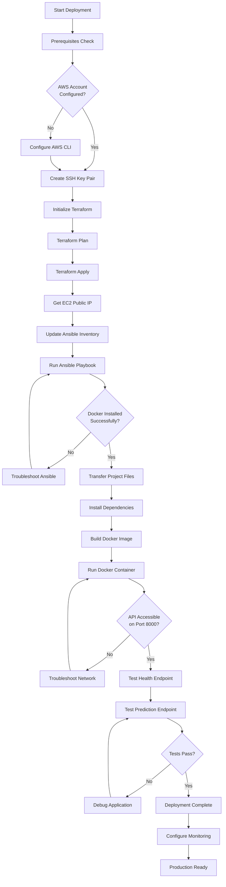
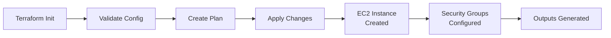
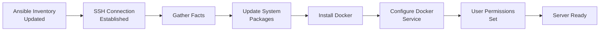
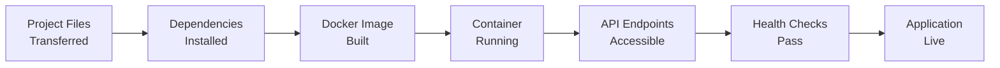
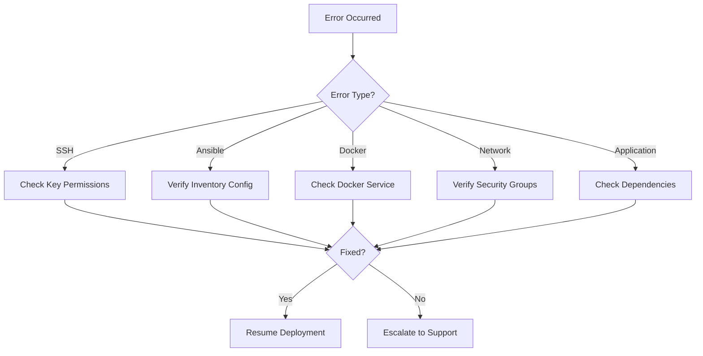

# Predictive Maintenance System - Deployment Flow

## 📋 Complete Deployment Workflow



## 🏗️ Detailed Phase Breakdown

### Phase 1: Infrastructure Setup


### Phase 2: Server Configuration


### Phase 3: Application Deployment


## 🔄 Error Handling Flow



## 📊 Status Monitoring

### Real-time Status Indicators
- 🟢 **Infrastructure**: EC2 instance running
- 🟢 **Configuration**: Ansible playbook completed
- 🟢 **Application**: Docker container running
- 🟢 **Network**: Port 8000 accessible
- 🟢 **API**: Health endpoint responding

### Health Check Endpoints
```bash
# System Health
curl http://43.205.126.47:8000/

# Prediction Test
curl -X POST "http://43.205.126.47:8000/predict" \
     -H "Content-Type: application/json" \
     -d '{"sensor1": 100, "sensor2": 200, "sensor3": 150}'
```

## 🎯 Success Criteria

### Infrastructure Success
- [x] EC2 instance running (t3.micro)
- [x] Security groups configured
- [x] SSH access working
- [x] Public IP accessible

### Configuration Success
- [x] Ansible playbook completed without errors
- [x] Docker installed and running
- [x] User permissions configured
- [x] System packages updated

### Application Success
- [x] Project files transferred
- [x] Dependencies installed
- [x] Docker image built
- [x] Container running
- [x] API endpoints responding
- [x] Predictions working

## 🚨 Failure Recovery

### Quick Recovery Steps
1. **SSH Issues**: Check key permissions and inventory config
2. **Ansible Failures**: Verify OS compatibility (dnf vs apt)
3. **Docker Issues**: Restart service and check user groups
4. **Network Issues**: Verify security groups and firewall rules
5. **App Issues**: Check dependencies and model file paths

### Emergency Procedures
```bash
# Full system reset
terraform destroy
terraform apply

# Quick application restart
docker restart $(docker ps -q)

# Manual deployment fallback
ssh ec2-user@IP
pip3 install -r requirements.txt
python3 -m uvicorn api.app:app --host 0.0.0.0 --port 8000
```

## 📈 Performance Metrics

### Deployment Time Targets
- Infrastructure: < 5 minutes
- Configuration: < 10 minutes
- Application: < 5 minutes
- Total: < 20 minutes

### Resource Utilization
- CPU: < 50% during normal operation
- Memory: < 512MB for t3.micro
- Storage: < 10GB for application
- Network: < 10Mbps average

## 🔧 Maintenance Schedule

### Daily Checks
- [ ] API health endpoint
- [ ] Docker container status
- [ ] System resource usage
- [ ] Error logs review

### Weekly Tasks
- [ ] Security updates
- [ ] Log rotation
- [ ] Backup verification
- [ ] Performance monitoring

### Monthly Tasks
- [ ] AMI updates
- [ ] Dependency updates
- [ ] Security audits
- [ ] Cost optimization

## 📞 Support Escalation

### Level 1: Self-Service
- Check troubleshooting guide
- Review error logs
- Test individual components
- Verify configurations

### Level 2: Documentation
- Deployment guide
- Cheatsheet commands
- Testing procedures
- Known issues

### Level 3: Expert Support
- AWS support tickets
- Infrastructure issues
- Security incidents
- Performance problems

---

*Deployment Flow Diagram - Predictive Maintenance System*